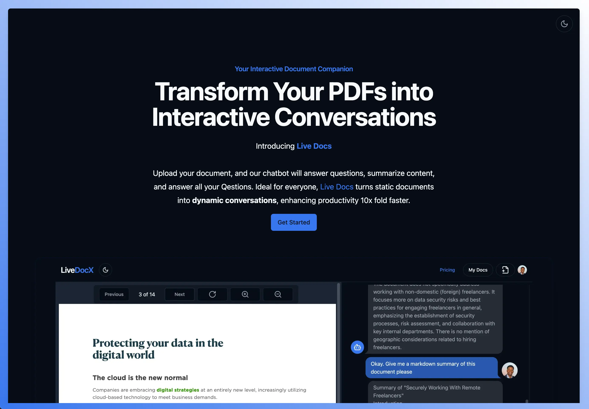

# LiveDocX - Your AI Collaborative Document Platform :+1:

LiveDocX is a web application that allows users to upload, view, and collaborate on PDF documents. It's built with Next.js, Firebase, and Clerk for a seamless and secure experience.



## Features

- **Upload PDFs:** Easily upload your PDF documents to LiveDocX.
- **View PDFs:** View your uploaded PDFs with a clean and intuitive interface.
- **Collaboration:** Coming soon!
- **Secure Storage:** Your documents are securely stored on Firebase.
- **User Authentication:** Sign up and log in with Clerk for a personalized experience.

## Getting Started

**1. Clone the repository:**

```bash
  git clone https://github.com/E-sims/live-docs.git
```

**2. Install dependencies:**

```bash
  cd live-docs
  npm install
```

**3. Set up Firebase:**

- Create a new Firebase project.
- Enable the following Firebase services:
  - Authentication
  - Firestore
  - Storage
- Create a `.env.local` file in the root directory and add the following environment variables:
  ```
    NEXT_PUBLIC_FIREBASE_API_KEY=YOUR_FIREBASE_API_KEY
    NEXT_PUBLIC_FIREBASE_AUTH_DOMAIN=YOUR_FIREBASE_AUTH_DOMAIN
    NEXT_PUBLIC_FIREBASE_PROJECT_ID=YOUR_FIREBASE_PROJECT_ID
    NEXT_PUBLIC_FIREBASE_STORAGE_BUCKET=YOUR_FIREBASE_STORAGE_BUCKET
    NEXT_PUBLIC_FIREBASE_MESSAGING_SENDER_ID=YOUR_FIREBASE_MESSAGING_SENDER_ID
    NEXT_PUBLIC_FIREBASE_APP_ID=YOUR_FIREBASE_APP_ID
    NEXT_PUBLIC_FIREBASE_MEASUREMENT_ID=YOUR_FIREBASE_MEASUREMENT_ID
  ```

**4. Set up Clerk:**

- Create a new Clerk account.
- Create a new application in Clerk.
- Add the following environment variables to the `.env.local` file:
  ```
    NEXT_PUBLIC_CLERK_PUBLISHABLE_KEY=YOUR_CLERK_PUBLISHABLE_KEY
    NEXT_PUBLIC_CLERK_SECRET_KEY=YOUR_CLERK_SECRET_KEY
  ```

**5. Run the development server:**

```
npm run dev
```

## Contributing

Contributions are welcome! Please open an issue or submit a pull request.

## License

This project is licensed under the [MIT License](https://opensource.org/licenses/MIT).

## Acknowledgements

- Next.js
- Firebase
- Clerk
- React PDF
- Lucide Icons
- Shadcn
